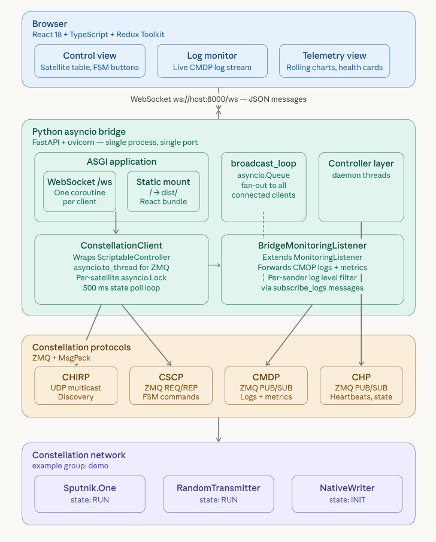

# Constellation Web Interface

A browser-based control and monitoring interface for [Constellation](https://constellation.pages.desy.de/constellation/), the autonomous DAQ system for dynamic experimental setups. This project demonstrates how MissionControl and Observatory could work as a unified web application — both as a standalone simulation and connected live to real Constellation satellites via a Python-based WebSocket bridge.

## Demo Video

[Watch the 2 min Demo Video](https://youtu.be/Bz5PRt5BP_E)

## Architecture

<div align="center">
  
</div>

The bridge wraps Constellation's `ScriptableController` and `MonitoringListener` in an async FastAPI app. It discovers satellites via CHIRP, dispatches CSCP commands, and forwards CMDP logs and heartbeat state over a single WebSocket to the browser.

## Features

### Control Panel (MissionControl equivalent)
- Global FSM controls: Initialize, Launch, Start, Stop, Land, Shutdown
- Satellite connection table with live state, last message, heartbeat interval and lives
- Right-click any satellite for individual commands (FSM transitions + queries like `get_version`, `get_config`, `get_state`)
- Query response modal showing command results from real satellites
- Click a satellite row to open its detail drawer (connection info, available commands)
- Run identifier with auto-incrementing sequence number and elapsed timer
- Mixed-state indicator (≈) in header when satellites are in different states

### Log Monitor (Observatory equivalent)
- Live scrolling log stream from CMDP, color-coded by severity level
- Filter by level, sender satellite, and free-text search
- Adjustable subscription level (server-side filtering — only receive messages above threshold)
- Pause/resume and clear controls
- Double-click any log entry to view full message details

### Telemetry (planned for GSoC)
- Currently shows simulated event rate and throughput charts in simulation mode
- Live metric forwarding from real satellites is wired in the bridge but the frontend view is not yet connected

### General
- **Live mode**: connects to real Constellation satellites through the WebSocket bridge
- **Simulation mode**: runs entirely in the browser with mock data generators (no backend needed)
- Dark/light theme toggle with persistent preference
- Satellite FSM enforces the same state transitions as the real Constellation protocol
- Optimistic UI updates: commands are sent over WebSocket AND applied locally for instant feedback; the server response overrides with the real final state

## Live Mode — Running with Real Satellites

### Prerequisites

- Python 3.11+
- Node.js 18+
- ConstellationDAQ >= 0.7

### One-time setup

```bash
cd ~/repos/constellation-assignment

# Create a Python venv and install all backend dependencies
python3 -m venv .venv
source .venv/bin/activate
pip install -e assignment/backend/

# Install frontend dependencies
cd assignment
npm install
```

### Running (5 terminals)

**Terminal 1 — Satellite: PyRandomTransmitter**
```bash
source .venv/bin/activate
python -m constellation.satellites.PyRandomTransmitter --name Sender --group constellation
```

**Terminal 2 — Satellite: PyDevNullReceiver**
```bash
source .venv/bin/activate
python -m constellation.satellites.PyDevNullReceiver --name Receiver --group constellation
```

**Terminal 3 — Satellite: Mariner**
```bash
source .venv/bin/activate
python -m constellation.satellites.Mariner --name Probe --group constellation
```

**Terminal 4 — Start the WebSocket bridge:**
```bash
source .venv/bin/activate
cd assignment/backend
python run.py --group constellation
```
The bridge discovers satellites via CHIRP and serves the WebSocket API on `ws://localhost:8000/ws`.

**Terminal 5 — Start the frontend dev server:**
```bash
cd assignment
npm run dev
```

Open **http://localhost:5173**. The header badge should show **Live** (green dot). You should see the 3 satellites in the connection table.

> **Tip:** You can also use `python assignment/backend/launch_satellites.py --group constellation` to start all 3 satellites in a single terminal instead of terminals 1-3.

### Quick walkthrough (live mode)

1. Satellites appear in `NEW` state in the table
2. Click **Initialize** — all transition to `Initialized`
3. Click **Launch** — all move to `Orbiting`
4. Click **Start** — all enter `Running`, the run timer begins
5. Right-click any satellite → `get_version` to see a query response modal
6. Switch to **Logs** tab — real CMDP log messages stream in
7. Click **Stop** → **Land** to bring satellites back down
8. Right-click a single satellite for individual FSM commands

## Simulation Mode (no backend needed)

```bash
cd ~/repos/constellation-assignment/assignment
npm install
npm run dev
```

Open **http://localhost:5173**. The app runs entirely client-side with simulated satellites, logs, and telemetry. Useful for frontend development and testing UI without Constellation installed.

## Bridge Configuration

The bridge reads settings from environment variables or a `.env` file in `assignment/backend/`. See `.env.example`:

| Variable | Default | Description |
|---|---|---|
| `CONSTELLATION_GROUP` | `constellation` | Group name — must match satellite `--group` |
| `CONSTELLATION_INTERFACE` | (all) | Restrict CHIRP discovery to a network interface |
| `LOG_LEVEL` | `INFO` | Bridge log verbosity |
| `HOST` | `0.0.0.0` | Bind address |
| `PORT` | `8000` | Bind port |
| `POLL_INTERVAL` | `0.5` | Seconds between heartbeat state polls |

## Tech Stack

| Layer | Technology |
|---|---|
| Frontend | React 18, Redux Toolkit, Vite, Recharts |
| Styling | CSS Modules with CSS custom properties (dark/light themes) |
| Bridge | FastAPI, uvicorn, asyncio, pydantic-settings |
| DAQ integration | ConstellationDAQ Python package (CHIRP, CSCP, CMDP, CHP) |
| Transport | WebSocket (browser ↔ bridge), ZMQ (bridge ↔ satellites) |

## Project Structure

```
assignment/
  src/
    simulation/              # Mock data generators (simulation mode)
      satelliteFSM.js        # State machine, transitions, satellite factory
      logGenerator.js        # Realistic log message generation
      telemetryGenerator.js  # Simulated metrics
      useSimulation.js       # Hook that drives timed updates
    store/                   # Redux Toolkit slices + middleware
      satelliteSlice.js      # Satellite state, commands, query results
      logSlice.js            # Log entries + filtering
      runSlice.js            # Run identifier, sequence, elapsed timer
      telemetrySlice.js      # Telemetry data points
      connectionSlice.js     # WebSocket connection state (live/sim)
      websocketMiddleware.js # Bridges Redux with the WebSocket service
    services/
      websocket.js           # WebSocket client (connect, send, reconnect)
    components/
      layout/                # Header, Sidebar
      control/               # Satellite table, detail drawer, control buttons
      logs/                  # Log panel with filters
      telemetry/             # Charts and health indicators
  backend/
    bridge/
      app.py                 # FastAPI app factory, lifespan, broadcast loop
      ws.py                  # WebSocket endpoint (command dispatch, log subscribe)
      constellation_client.py # ScriptableController wrapper (CHIRP + CSCP)
      log_listener.py        # MonitoringListener subclass (CMDP log + metric forwarding)
      settings.py            # Pydantic settings model
    launch_satellites.py     # Starts 3 test satellites for local dev
    run.py                   # Bridge entry point (CLI)
```
